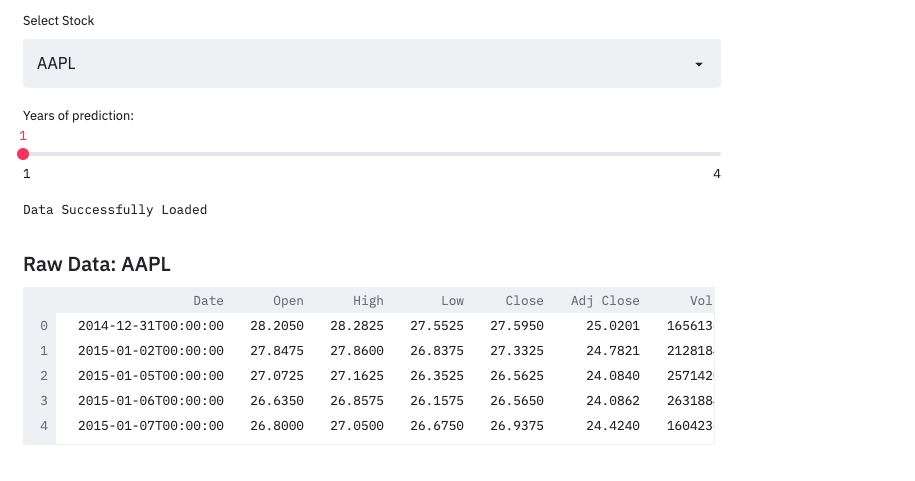
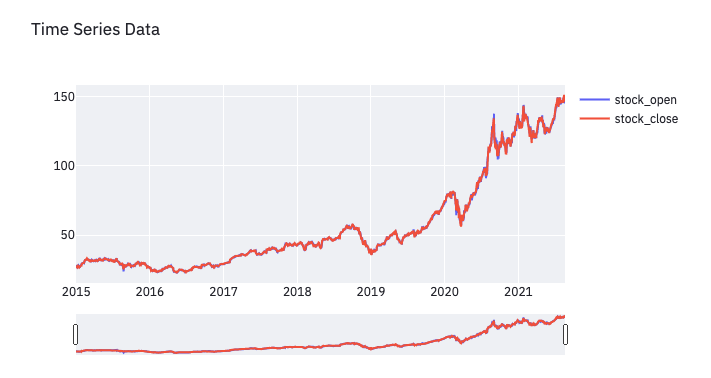
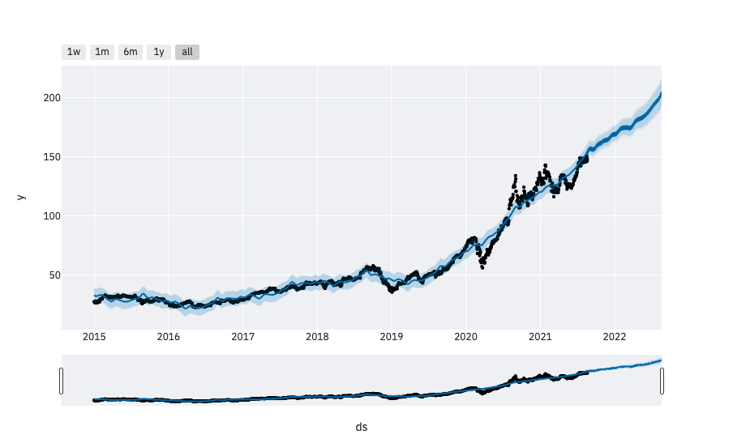

# STOCK-PRICE

- Note: This app uses Facebook - Prophets library
- A memory of at least 6GB is needed in the deployment environment.

## Raw Data

## Interactive Plots

## Forecast Plots


- The application uses streamlit.

## To run
- Clone
```shell
git clone git@github.com:shuklasaharsh/Stock-Prediction-Dash.git
```
- Install Requirements
```shell
pip install requirements.txt
```
- Run
```shell
streamlit run main.py
```

- This application will predict stock prices for the future.
